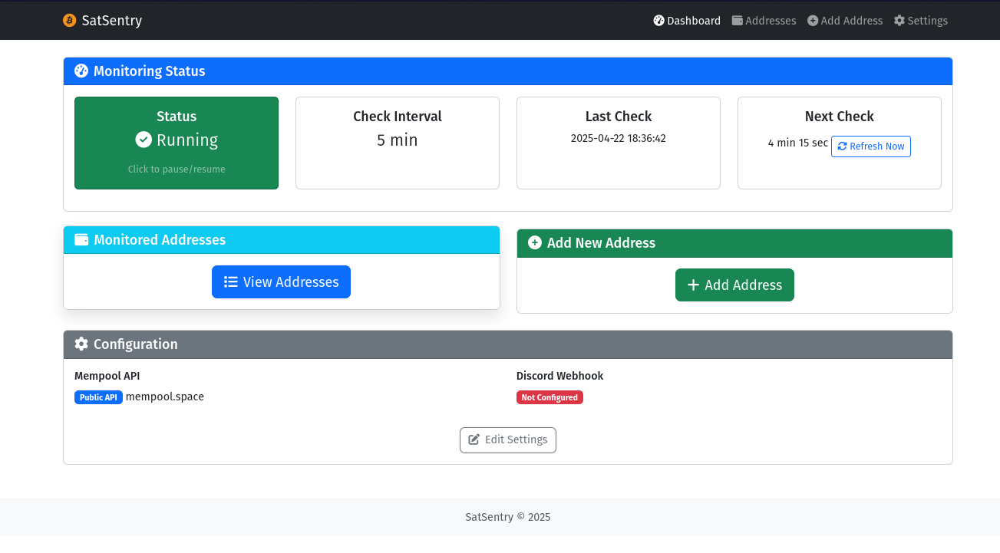
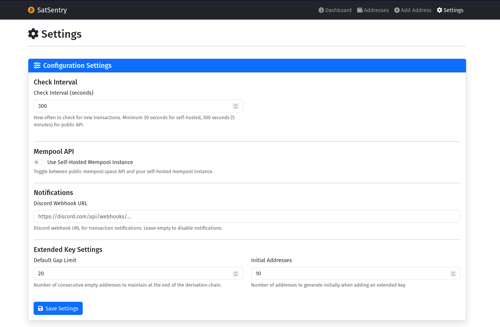
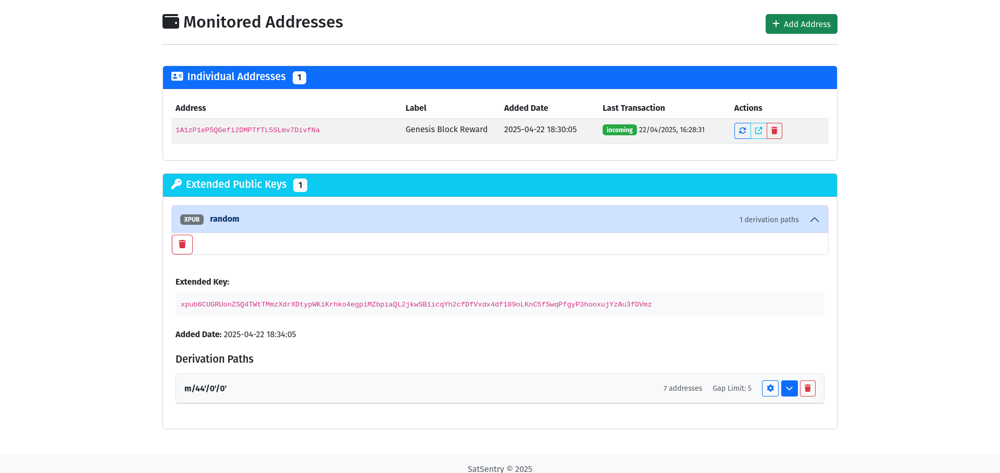
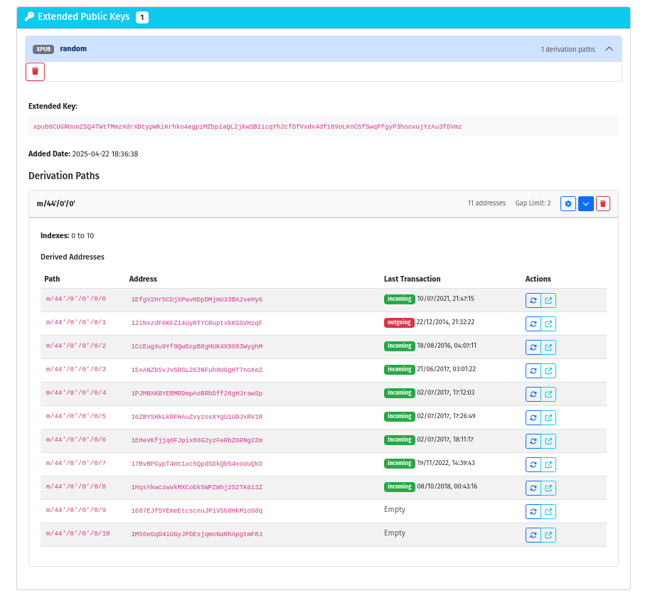

# SatSentry

A comprehensive software solution that provides real-time tracking of Bitcoin addresses and extended public keys (xpub/ypub/zpub) for incoming and outgoing transactions. The software notifies users via Discord webhooks when it detects transactions for any monitored address.

> [!WARNING]
> This is a custom tool made for research and learning purposes. Use at your own risk.

> [!IMPORTANT]
> Derivation of addresses from extended public keys is also custom and may contain bugs. Also, it doesn't cover all addresses types.

> [!IMPORTANT]
> I hope I shouldn't have to write this but any address shown in the screenshots is not mine but taken from the internet.

## Features

- Monitor individual Bitcoin addresses for transactions
- Monitor addresses derived from extended public keys (xpub/ypub/zpub)
- Show last transaction details for each address
- Support for both public mempool.space API and self-hosted mempool instances
- Receive detailed Discord notifications for transactions
- Configure check intervals

## Screenshots






## Installation

```bash
git clone https://github.com/DrPulse/satsentry.git
cd satsentry
```

### Using uv

```bash
uv sync
uv run satsentry
```

### Using python

```bash
pip install -r requirements.txt
python3 main.py
```

### Using Docker

1. Create the directories for BitSentry data

    ```bash
    mkdir -p ~/.sentry/{data,logs}
    ```

2. Build the Docker image

    ```bash
    docker build -t satsentry:latest .
    ```

3. Run the Docker container

    ```bash
    docker run --rm -p 5000:5000 -v ~/.sentry/data:/app/data -v ~/.sentry/logs:/app/logs satsentry:latest
    ```

Access the web interface at <http://localhost:5000>

## Configuration

### Settings

- **Check Interval**: How often to check for new transactions (in seconds)
- **Mempool API**: Choose between public mempool.space API or self-hosted instance
- **Discord Webhook**: URL for receiving notifications
- **Gap Limit**: Number of unused addresses to derive from extended public keys
- **Initial Addresses**: Number of addresses to derive initially from extended public keys

### Adding Addresses

- Individual addresses can be added with optional labels
- Extended public keys (xpub/ypub/zpub) can be added with custom derivation paths

## Development

### Installation and Running

```bash
uv sync
uv run satsentry
```

### Running Tests

```bash
uv run pytest
```

## Roadmap

- [ ] Use Github Actions for building the docker image and pushing it to a public registry
- [ ] Add other notifications channels ?
- [ ] Refactor the population of addresses from extended public keys to be more efficient and easier to maintain
- [ ] Better test coverage with better cases
- [ ] Umbrel app ?

## Contributing

Pull requests are welcome. For major changes, please open an issue first to discuss what you would like to change.

## License

[MIT](LICENSE)
